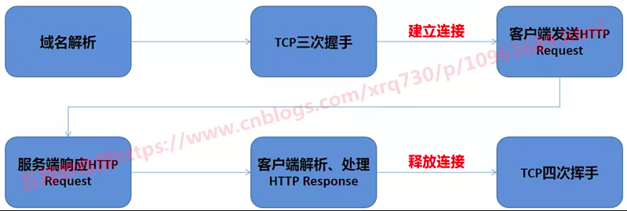
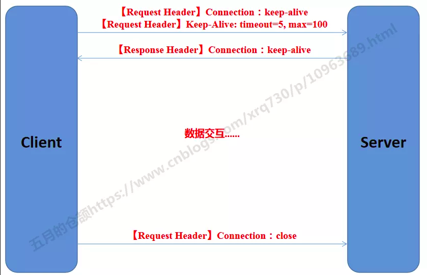
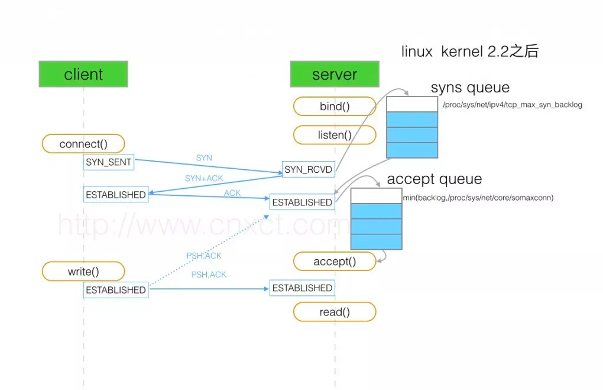
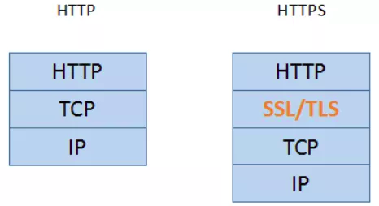
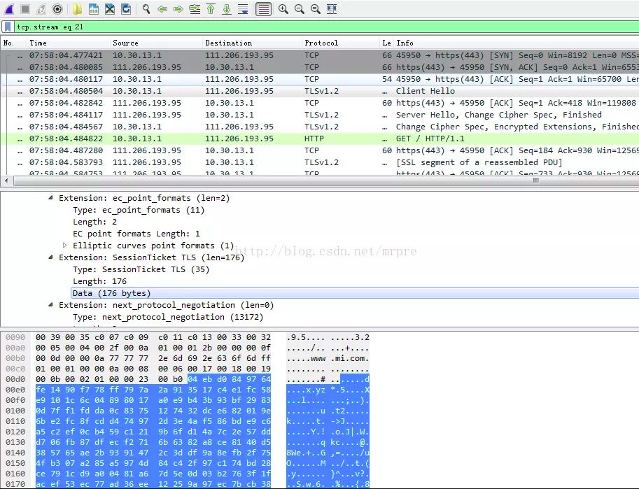

### 绕不开的长短连接

说起HTTP，必然绕不开的一个话题就是长短连接，这个话题之前的文章已经写了好多次了，这里再写一次。  
我们知道，从客户端发起一个HTTP请求到服务端响应HTTP请求之间，大致有以下几个步骤：  
  
HTTP1.0最早在网页中使用是1996年，那个时候只是使用一些较为简单的网页和网络的请求，每次请求都需要建立一个单独的连接，
上一次和下一次请求完全分离。这种做法，即使每次的请求量都很小，但是客户端和服务端每次建立TCP连接和关闭TCP连接都是相对比较费时的过程，
严重影响客户端和服务端的性能。  
基于以上的问题，HTTP1.1在1999年广泛应用于现在的各大浏览器网络请求中，同时HTTP1.1也是当前使用最为广泛的HTTP协议（2015年诞生了HTTP2，
但是还未大规模应用），这里不详细对比HTTP1.1针对HTTP1.0改进了什么，只是在连接这块，HTTP1.1支持在一个TCP连接上传送多个HTTP请求和响应，
减少了建立和关闭连接的消耗延迟，一定程度上弥补了HTTP1.0每次请求都要创建连接的缺点，这就是长连接，HTTP1.1默认使用长连接。  
那么，长连接是如何工作的呢？首先，我们要明确一下，长短连接是通信层（TCP）的概念，HTTP是应用层协议，它只能说告诉通信层我打算一段时间内
复用TCP通道而没有自己去建立、释放TCP通道的能力。那么HTTP是如何告诉通信层复用TCP通道的呢？看下图：  
  
分为以下几个步骤：
+  客户端发送一个Connection: keep-alive的header，表示需要保持连接
+  客户端可以顺带Keep-Alive: timeout=5,max=100这个header给服务端，表示tcp连接最多保持5秒，长连接接受100次请求就断开，
不过浏览器看了一些请求貌似没看到带这个参数的
+  服务端必须能识别Connection: keep-alive这个header，并且通过Response Header带同样的Connection: keep-alive，告诉客户端我可以保持连接
+  客户端和服务端之间通过保持的通道收发数据
+  最后一次请求数据，客户端带Connection：close这个header，表示连接关闭

至此在一个通道上交换数据的过程结束，在默认的情况下：
+  长连接的请求数量限定是最多连续发送100个请求，超过限制即关闭这条连接
+  长连接连续两个请求之间的超时时间是15秒（存在1~2秒误差），超时后会关闭TCP连接，因此使用长连接应当尽量保持在13秒之内发送一个请求
+  这些的限制都是在重用长连接与长连接过多之间做的一个折衷，因为长连接虽好，但是长时间的TCP连接容易导致系统资源无效占用，浪费系统资源。

最后这个地方多说一句http的keep-alive和tcp的keep-alive的区别，一个经常讲的问题，顺便记录一下：
+  http的keep-alive是为了复用已有连接
+  tcp的keep-alive是为了保活，即保证对端还存活，不然对端已经不在了我这边还占着和对端的这个连接，
浪费服务器资源，做法是隔一段时间发送一个心跳包到对端服务器，一旦长时间没有接收到应答，就主动关闭连接
### 性能提升的原因
通过前面的分析，很显而易见的，使用HTTP连接池提升性能最重要的原因就是省去了大量连接建立与释放的时间，除此之外还想说一点。  
TCP建立连接的时候有如下流程：  
  
如图所示，这里面有两个队列，分别为syns queue（半连接队列）与accept queue（全连接队列）。  
一旦不使用长连接而每次连接都重新握手的话，队列一满服务端将会发送一个ECONNREFUSED错误信息给到客户端，
相当于这次请求就失效了，即使不失效，后来的请求需要等待前面的请求处理，排队也会增加响应的时间。  
By the way，基于上面的分析，不仅仅是HTTP，所有应用层协议，例如数据库有数据库连接池、hsf提供了hsf接口连接池，
使用连接池的方式对于接口性能都是有非常大的提升的，都是同一个道理。  
### TLS层的优化
上面讲的都是针对应用层协议使用连接池提升性能的原因，但是对于HTTP请求，我们知道目前大多数网站都运行在HTTPS协议之上，即在通信层和应用层之间多了一层TLS：  
  
通过TLS层对报文进行了加密，保证数据安全，其实在HTTPS这个层面上，使用连接池对性能有提升，TLS层的优化也是一个非常重要的原因。  
HTTPS原理不细讲了，反正大致上就是一个证书交换-->服务端加密-->客户端解密的过程，整个过程中反复地客户端+服务端交换数据是一个耗时的过程，
且数据的加解密是一个计算密集型的操作消耗CPU资源，因此如果相同的请求能省去加解密这一套就能在HTTPS协议下对整个性能有很大提升了，
实际上这种优化是有的，这里用到了一种会话复用的技术。  
TLS的握手由客户端发送Client Hello消息开始，服务端返回Server Hello结束，整个流程中提供了2种不同的会话复用机制，这个地方就简单看一下，知道有这么一回事：  
+  session id会话复用----对于已建立的TLS会话，使用session id为key（来自第一次请求的Server Hello中的session id），
主密钥为value组成一对键值对保存在服务端和客户端的本地。当第二次握手时，客户端如果想复用会话，则发起的Client Hello中带上session id，
服务端收到这个session id检查本地是否存在，有则允许会话复用，进行后续操作
+  session ticket会话复用----一个session ticket是一个加密的数据blob，其中包含需要重用的TLS连接信息如session key等，
它一般使用ticket key加密，因为ticket key服务端也知道，在初始化握手中服务端发送一个session ticket到客户端并存储到客户端本地，
当会话重用时，客户端发送session ticket到服务端，服务端解密成功即可复用会话  
session id的方式缺点是比较明显的，主要原因是负载均衡中，多机之间不同步session，如果两次请求不落在同一台机器上就无法找到匹配信息，
另外服务端存储大量的session id又需要消耗很多资源，而session ticket是比较好解决这个问题的，但是最终使用的是哪种方式还是有浏览器决定。
关于session ticket，在网上找了一张图，展示的是客户端第二次发起请求，携带session ticket的过程：  
  
一个session ticket超时时间默认为300s，TLS层的证书交换+非对称加密作为性能消耗大户，通过会话复用技术可以大大提升性能。  
### 使用连接池的注意点
使用连接池，切记每个任务的执行时间不要太长。  
因为HTTP请求也好、数据库请求也好、hsf请求也好都是有超时时间的，比如连接池中有10个线程，并发来了100个请求，一旦任务执行时间非常长，
连接都被先来的10个任务占着，后面90个请求迟迟得不到连接去处理，就会导致这次的请求响应慢甚至超时。  
当然每个任务的业务不一样，但是按照我的经验，尽量把任务的执行时间控制在50ms最多100ms之内，如果超出的，可以考虑以下三种方案：  
+ 优化任务执行逻辑，比如引入缓存
+ 适当增大连接池中的连接数量
+ 任务拆分，将任务拆分为若干小任务
### 连接池中的连接数量如何设置
有些朋友可能会问，我知道需要使用连接池，那么一般连接池数量设置为多少比较合适？有没有经验值呢？首先我们需要明确一个点，连接池中的连接数量太多不好、太少也不好：  
+ 比如qps=100，因为上游请求速率不可能是恒定不变的100个请求/秒，可能前1秒900个请求，后9秒100个请求，平均下来qps=100，当连接数太多的时候，
可能出现的场景是高流量下建立连接--->低流量下释放部分连接--->高流量下重新建立连接的情况，相当于虽然使用了连接池，但是因为流量不均匀反复建立连接、释放链接
+ 线程数太少当然也是不好的，任务多而连接少，导致很多任务一直在排队等待前面的执行完才可以拿到连接去处理，降低了处理速度
那针对连接池中的连接数量如何设置的这个问题，答案是没有固定的，但是可以通过估算得到一个预估值。  

首先开发同学对于一个任务每天的调用量心中需要有数，假设一天1000W次好了，线上有10台服务器，那么平均到每台服务器每天的调用量在100W，100W平均到1天的86400秒，
每秒的调用量1000000 / 86400 ≈ 11.574次，根据接口的一个平均响应时长适当加一点余量，差不多设置在15~30比较合适，根据线上运行的实际情况再做调整。

